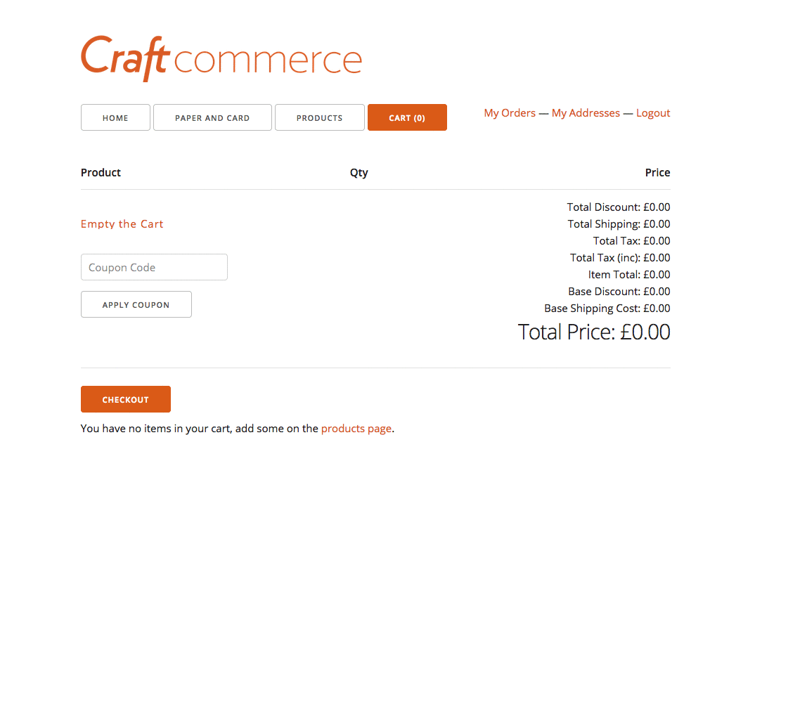

# Repeat Order plugin for Craft CMS

Repeat an order within Craft Commerce from a completed orders history


## Installation

To install Repeat Order, follow these steps:

1. Download & unzip the file and place the `repeatorder` directory into your `craft/plugins` directory
2.  -OR- do a `git clone ???` directly into your `craft/plugins` folder.  You can then update it with `git pull`
3.  -OR- install with Composer via `composer require /repeatorder`
4. Install plugin in the Craft Control Panel under Settings > Plugins
5. The plugin folder should be named `repeatorder` for Craft to see it.  GitHub recently started appending `-master` (the branch name) to the name of the folder for zip file downloads.

Repeat Order works on Craft 2.4.x, Craft 2.5.x and Craft 2.6.x.

## Repeat Order Overview

Allows a user to repeat a previous order when using craft commerce.

## Configuring Repeat Order

No settings available currently so configuration isn't necessary

## Using Repeat Order

The action, redirect and orderId inputs are required, but the rest can be fully customised.

Here is an example form to get you started:

```
<form method="POST" accept-charset="UTF-8">
    <input type="hidden" name="action" value="repeatOrder/reorder/addOrder">
    <input type="hidden" name="redirect" value="basket">
    {{ getCsrfInput() }}
    <input name="orderId" type="hidden" value="{{ order.id }}">
    <input class="repeat" value="Repeat this order" type="submit">
</form>
```

A notice can be displayed on the basket when the current stock is less than the quantity being added to the cart. The quantity is adjusted as a result or removed completely if out of stock. This notice can be displayed on the basket page like so:


```


	
		<div class="reorder-errors">
			{{ notice|raw }}
		</div>
	

```

Brought to you by [Matt Shearing](https://adigital.agency)

